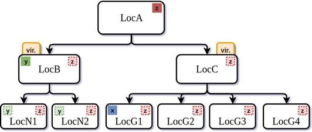

# Gecko 

This repo contains Gecko Runtime Library. With help of a set of directives, Gecko addresses multi-level memory hierarchy in current and future modern architectures and platforms.



------------------

## Constructs

###  Location

The principal constructs of *Gecko* model are *locations*. Locations are an abstraction of storage and computational resources available in the system and are represented as a node in *Gecko*’s tree-based hierarchy model. Similar to the Parallel Memory Hierarchy (PMH) model, *Gecko* is a tree of memory modules with workers at the leaves. Workers will perform computations and they attach to the memory modules. The figure shown below illustrates an example of our *Gecko* model. This model represents a regular cluster/supercomputer node with two non-uniform memory access (NUMA) multicore processors, *LocNi*, and four GPUs, *LocGi*, similar to ORNL’s Titan supercomputer.


### Location Type

The location hierarchy in *Gecko* designates how one location shares its allocated memories with another. When a memory is allocated in a location, the allocated memory is accessible by its children. They will have access to the same address as their parent has. However, the allocated memory is not shared with their parent and is considered to be a private memory with respect to their parent. The above figure shows how hierarchy will affect memory accesses among locations. The allocated memory *y* is allocated in Location *LocB* and consequently, it can be accessed by *LocB*, *LocN1*, and *LocN2*. However, *LocA* has no knowledge of the variable *y*. With the same logic, allocated memory *z* can be accessed by all locations, while accesses to *x* is only limited to *LocG1*.

In *Gecko*, locations are categorized by one of the followings: 1) a memory module, 2) a memory module with worker, and 3) a *virtual* location. Memory modules are annotated with their attributes (like type and size); *LocA* in the above figure is a memory module. If a location is a memory module with a worker attached to it, the location will be used to launch computational kernel by the runtime library; *LocNi* and *LocGi* are examples of memory modules with workers. Finally, the virtual locations, *LocB* and *LocC* in the above figure, are neither memory modules nor computational ones. They are an abstract representation of their children in the hierarchy. Grouping a set of locations under a virtual location provides a powerful feature for the application to address the location set as a whole. Similar approaches have been observed in related work. Like other location categories, virtual locations can also be the target of memory allocation and kernel launch requests. Depending on the type of requests and hints from scientific developers, the runtime library will act upon the requests and perform them at the execution time.

Locations are abstractions of available resources in the system. Any location in *Gecko*, internal or leaf locations, is possibly the target of a kernel launch by application. Virtual locations, however, provide flexibility to the applications. With virtual locations, applications aptly fix the target of their kernel to that location while changing the underlying structure of the tree for the same location. As a result, the application targeted for a multicore architecture dynamically or statically morphs into a program targeting different types of accelerators (e.g., NVIDIA GPUs, AMD GPUs, or FPGAs).

For further details, please refer to the Gecko's paper.


## Directives

Below are the set of Gecko's directives.

**Hint:** All keywords are mandatory unless they are put inside `[]`, which in that case, they are considered as optional.

### Location Type
The first step in utilizing Gecko is to declare all location types. This is achieved by the `loctype` construct. It accepts the following keywords:

```C++
#pragma gecko loctype name(char*) kind(char*, char*)
```

 - `name`: the name of the location type (`char*`).
 - `kind`: the type of the location type (`char* , char*`) from the declared ones by `loctype`.


**Note:** The `virtual` name is reserved for the virtual location type.

**Note 2:** This construct is a Work-In-Progress (WIP) and experimental. At this stage, we support extra keywords that are shown in the example below.

**Example:** The first line in the following code snippet declares that our application will require a host CPU with 4 cores and of Intel's Skylake type. The second line declares a minimum NVidia GPU with Compute Capability of 5.0 (`cc50`) and names it `tesla` for future references in defining locations. The third line specifies the main memory module in our system with 16 GB in size.


```C++
#pragma gecko loctype name("host") kind("x64", "Skylake") num_cores(4) mem("4MB")
#pragma gecko loctype name("tesla") kind("NVIDIA", "cc50") mem("4GB")
#pragma gecko loctype name("NODE_MEMORY") kind("Unified_Memory") size("16GB")
```


### Location

Locations in Gecko are defined using the `location` construct as shown below. It accept the following keywords:

```C++
#pragma gecko location name(char*) type(char*) [all]
```

 - `name`: the name of the location (`char*`).
 - `type`: the type of the location (`char*`) from the declared ones by `loctype`.
 - `all`: defining all devices with similar location type under one umbrella. This will result in the following naming convetion: `<name>[i]` where `<name>` is the name of the location and `[i]` provides a way to distinguish the locations.


**Example:** below lines define the locations used in the model shown above.

```C++
#pragma gecko location name("LocA") type("NODE_MEMORY")
#pragma gecko location name("LocB","LocC") type("virtual")
#pragma gecko location name("LocN1", "LocN2") type("host")
#pragma gecko location name("LocG1", "LocG2", "LocG3", "LocG4") type("tesla")
```

### Hierarchy

The hierarchy in Gecko determines the relationship among locations with respect to each other. Every hierarchy in Gecko has two associated entities: a parent and a child. Both of them are predefined locations.

```C++
#pragma gecko hierarchy children(<op> : <list>) parent(char*) [all]
```

 - `parent`: the parent location in the relationship (`char*`).
 - `children`: the list of all locations to be the children of `parent`. The keyword accepts an operation and the children list: `(<op> : <list>)`. The `op` can be `+` and `-` signs or a `char` variable that is either `+` or `-`. The `<list>` is the comma-separated list of defined locations (name of the locations in `char*`).
 - `all`: similar to the `all` keyword in the `hierarchy`, this keyword is used to include `all` locations under this hierarchy.


**Example:** Below lines shows how to use hierarchy construct. *Please pay attention to the three approach that we used the operation in our examples. All three perform exactly the same operation.*

```C++
char op = '+';
#pragma gecko hierarchy children(+:"LocB","LocC") parent("LocA")
#pragma gecko hierarchy children('+':"LocN1","LocN2") parent("LocB")
#pragma gecko hierarchy children(op:"LocG1","LocG2","LocG3","LocG4") parent("LocC")
```

**Note:** at this point, we have constructed the whole tree in the example shown in the above figure.


## Configuration File

The whole structure of the hierarchy tree can be stored within a configuration file. Gecko can load such file and populate the tree. This brings a great flexibility to the user and makes the application extremely portable. Its keywords are shown below:

 - `file`: the configuration file name.
 - `env`: the `GECKO_CONFIG_FILE` environment variable contains the path to the file. Please refer to the section describing the environmental variables below.

**Note:** The `file` and `env` could not be chosen simultaneously. 

```C++
#pragma gecko config env
#pragma gecko config file("/path/to/config/file")
```


**Example:** An example of a configuration file for above-mentioned hierarchy tree is shown below:

```CSV
loctype;kind,x64,Skylake;num_cores,4;mem,4MB;name,host;
loctype;name,tesla;kind,CC7.0,Volta;mem,4GB
loctype;name,NODE_MEMORY;kind,Unified_Memory;size,16GB

location;name,LocA;type,NODE_MEMORY;
location;name,LocB,LocC;type,virtual
location;name,LocN1,LocN2;type,host;
location;name,LocG1,LocG2,LocG3,LocG4;type,tesla

hierarchy;children,+,LocB,LocC;parent,LocA
hierarchy;children,+,LocN1,LocN2;parent,LocB
hierarchy;children,+,LocG1,LocG2,LocG3,LocG4;parent,LocC
```


## Drawing

For convenience, Gecko can generate the hierarchical tree for visualization purposes. Using `draw` construct, at any point at executing the program, the runtime library will generate a compatible DOT file. Eventually, one can convert a DOT file to a PDF file using the dot command: `dot -Tpdf gecko.conf -o gecko-tree.pdf`

The syntax to use `draw` is as following. It accepts a `root` keyword, which user should provide the location name of the root node in the hierarchy.

```C++
#pragma gecko draw root(char*) filename(char*)
```

 - `root`: the root node in the hierarchy tree (`char*`).
 - `filename`: the target DOT file name (`char*`). It can be absolute or relative path. The default value for this keyword is `"gecko.dot"`.


**Example:**

```C++
#pragma gecko draw root("LocA")
```


## Memory Operations

Memory operations in Gecko are supported by the `memory` construct. To allocate memory, use `allocate` keyword and to free the object, use `free`.

```C++
#pragma gecko memory allocate(<ptr>[0:<count>]) type(<datatype>) location(char*)
#pragma gecko free(<ptr_list>)
```

 - `allocate(<ptr>[0:<count>])`: the input to the `allocate` keyword accepts a pointer (`<ptr>`) and its number of elements (`<count>`). `<count>` can be a constant or a variable. *Please see the example below.*
 - `datatype`: the data type of the `ptr` variable.
 - `<ptr_list>`: list of allocated variables by `allocate`. It can have one or more than one variable.


**Example**:

```C++
int N = 2000;
// place-holders for our memory locations
double *X, *Y, *Z, *W;
#pragma gecko memory allocate(X[0:N]) type(double) location("LocA")
#pragma gecko memory allocate(Y[0:N]) type(double) location("LocB")
#pragma gecko memory allocate(Z[0:N]) type(double) location("LocC")
#pragma gecko memory allocate(W[0:N]) type(double) location("LocG1")
//...<some computation>...
#pragma gecko memory free(X, Y, Z, W)
```


## Region

Gecko recognizes the computational kernels with the `region` construct. The end of the region is recognized with the `end` keyword.

```C++
#pragma gecko region at(char*) exec_pol(char*) variable_list(<ptr_list>)
// the OpenACC kernel
#pragma gecko region end
```

 - `at`: the destination location to execute the code.
 - `datatype`: the execution policy to execute the kernel. *Please refer to execution policy section for more details.*
 - `<ptr_list>`: list of utilized variables within the region.


**Example:**
```C++
double coeff = 3.4;
int a = 0;
int b = N;
#pragma gecko region at("LocA") exec_pol("static") variable_list(Z,Q)
#pragma acc parallel loop
for (int i = a; i<b; i++) {
	Z[i] = Q[i] * coeff;
}
#pragma gecko region end
```


## Synchronization point (wait)

By default, regions in Gecko are executed asynchronously. Synchronization points in Gecko are expressed with the `pause` construct. The granularity at which the synchronization happens can be controlled with the `at` keyword. The location is an optional input. If the location is not specified, Gecko waits for all resources to finish their work.

 - `at`: the location to wait on

```C++
#pragma gecko region pause [at(char*)]
```

**Example:**
```C++
#pragma gecko region pause at("LocA")
```

------------------


## Execution Policies

Gecko supports a number of execution policies by default. Among those, we have `static`, `flatten`, `range`, `percentage`, and `any`.

In static distribution, the iteration space is divided evenly among children of that location. This policy is similar to the ones with the same name in OpenACC and OpenMP. Suppose we have a for-loop with 1,000,000 iterations. For our above-mentioned example tree, if we target location LocC, Gecko will assign each LocGs[i] location 250,000 iterations to process.

Flatten distribution is similar to the static distribution in its even distribution approach. In static, all the siblings of a location contribute equally in the distribution of workload. However, in flatten, all leaves (workers) contribute equally. Let's suppose LocB becomes a child of LocB and 1,000,000 iterations are about to be launched on LocB. Static strategy implies that each child of LocB is assigned 500,000 iterations. Then, Gecko splits the iteration space for LocB and LocC. As a result, each child of LocB operates on 250,000 iterations while each child of LocC operates on 125,000 iterations. However, flatten strategy divides the iteration space equally among leaf locations. Every child in both LocB and LocC locations will operate on 166,666 iterations. So, when flatten policy is chosen, the runtime finds the number of available workers below the chosen location in the tree and splits the iteration space evenly.

Gecko provides more flexibility in workload distribution with customized iteration ranges. An application is able to fine-tune the assigned ranges to each location hoping that such distribution leads to a better workload balance among workers in those locations. In such cases, one can provide an array of percentages or numbers to represent the policy. Considering the previous example with 1,000,000 iterations, one can provide percentage[20, 30, 40, 10] or range[200000, 300000, 400000, 100000] as a distribution policy to Gecko, which both approaches lead to the same workload strategy. In case the targeted location, similar to LocB, does not have four children, Gecko will assign the percentage and numbers from the beginning to children of the targeted location. The rest of the numbers in the list are assigned to other locations in a round-robin or work-stealing fashion. The static strategy is a special case of percentage and range strategies where we have percentage[25, 25, 25, 25] or range[250000, 250000, 250000, 250000] in our example.

In some cases, we are only interested in engaging only one of the locations of the hierarchy. As long as only a single location is chosen, an application is not committed to run in a specific location. In such cases, Gecko will find an idle location among children of the chosen target. Alternatively, based on the recorded history, Gecko can also choose the best architecture for this kernel if we are targeting a multi-architecture virtual location. For the above-mentioned example, in our current implementation, all the 1,000,000 iterations are assigned to a child of LocC in the hierarchy, if LocC is chosen as the target.


------------------

## Environmental Variables

### GECKO_HOME

 - Compile-time variable.
 - Specifies the path to the Gecko's folder.

### GECKO_CONFIG_FILE

 - Run-time variable.
 - Specifies the path to a configuration file. If this variable is set, the file that this path is pointing to will be used to populate the hierarchy tree.

### GECKO_POLICY

 - Run-time variable.
 - Specifies the execution policy for all the regions in the code. If it is set, all the regions in the code will be executed with a policy among the described one above.

------------------

## Contact

To contact developers, please email to Millad Ghane (mghane2@uh.edu).
